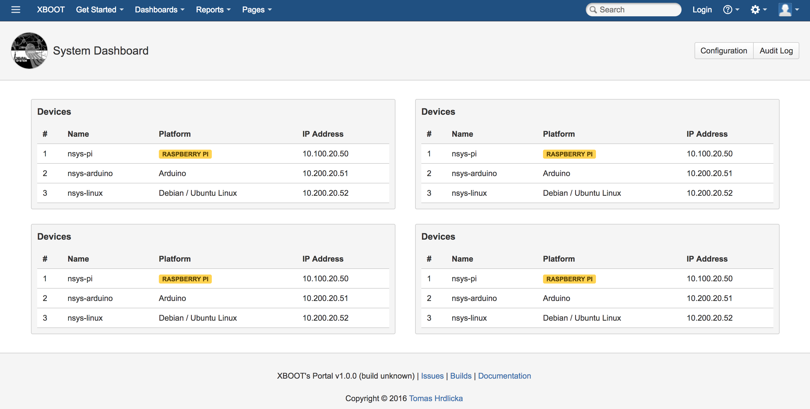
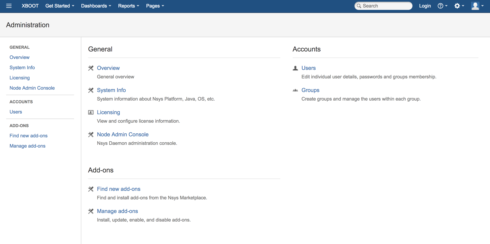
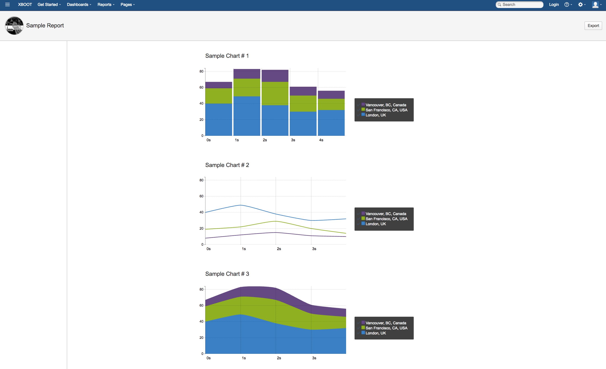

# Welcome to the AUI Demo Source!

## Quick links

* [Atlassian User Interface (AUI)][1]
* [Spring Framework][2]
* [Nsys Platform][3]

## Description

AUI Demo is an example of AUI (Atlassian User Interface) implementation in a web application based on Spring framework.
The code is based on source code of [Nsys Portal](http://nsys.org).

### Quick start

 * cd "project root"
 * ./build.sh
 * ./run-portal.sh
 * vi target/aui-demo/logs/aui-demo-webapp.log
 * Browse to [http://localhost:8080](http://localhost:8080).

[1]: https://docs.atlassian.com/aui
[2]: https://projects.spring.io/spring-framework
[3]: http://nsys.org